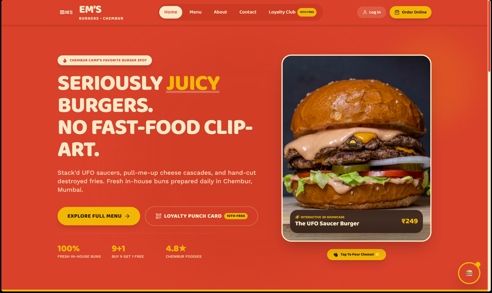
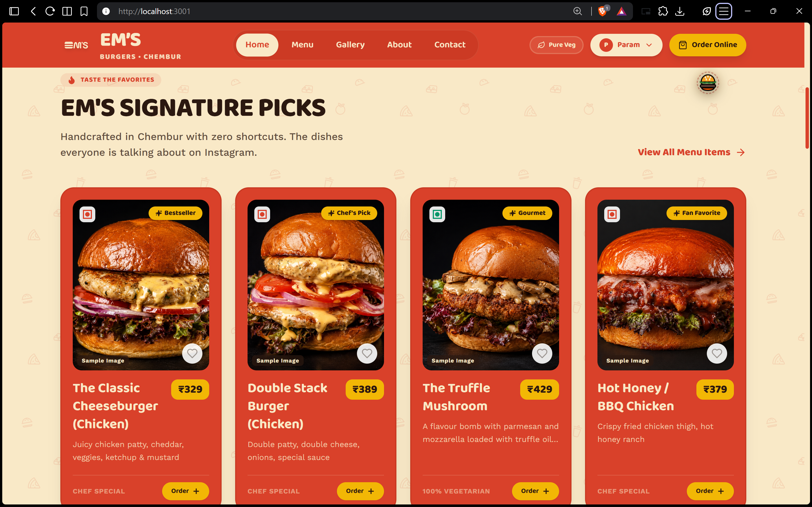
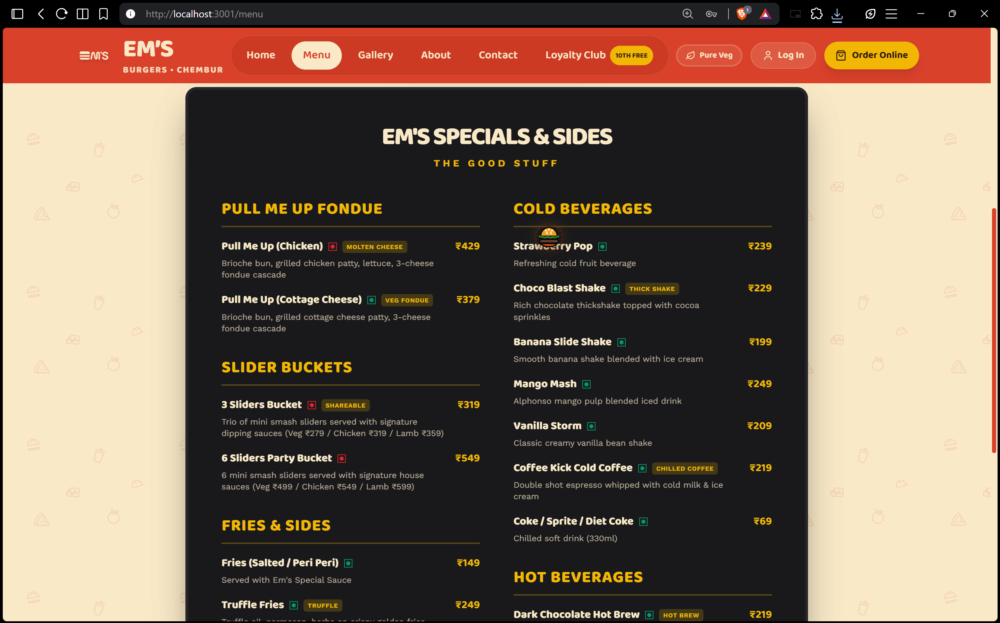

# EMS Burger







A Vite + React website for EMS Burger.

## Prerequisites
Before you start, ensure you have the following installed on your machine:
- **Node.js** (Version 18 or newer is recommended)
- **npm** (Comes with Node.js)
- A modern web browser

## Step-by-Step Setup Guide

Follow these instructions to run the project perfectly on your local machine:

1. **Clone or Download the Repository**
   Download the project files to your computer and extract them, or clone the repository via Git.

2. **Open the Project in your Terminal**
   Open your terminal (Command Prompt, PowerShell, or Terminal on macOS/Linux) and navigate to the project folder. For example:
   ```bash
   cd path/to/EmsBurger
   ```

3. **Install Dependencies**
   Run the following command to install all required packages. **Do not skip this step!**
   ```bash
   npm install
   ```

4. **Start the Development Server**
   Once the installation is complete, start the app by running:
   ```bash
   npm run dev
   ```

5. **View the Application**
   The terminal will display a local URL (usually `http://localhost:3001` or `http://localhost:5173`). Open that URL in your web browser.

## Troubleshooting (Common Issues)

**Issue: "Red Screen" Error in Browser**
If you see a red error overlay (Vite Error) when opening the site, it is usually caused by one of the following:
- **Missing Dependencies**: You might have skipped `npm install`. Stop the server (Ctrl+C) and run `npm install` again.
- **Corrupted node_modules**: Sometimes dependencies get corrupted. Delete the `node_modules` folder and the `package-lock.json` file, then run `npm install` and start again.
- **Case-Sensitive Imports**: If you're on a Mac or Linux, file paths are case-sensitive. Ensure you didn't change any file names to uppercase/lowercase by accident.
- **Node.js Version**: Ensure you are using Node 18 or higher.

**Issue: Port Already in Use**
If port 3001 is busy, Vite will automatically select the next available port. Check your terminal output for the correct URL.

## Build for Production
To create an optimized production build, run:
```bash
npm run build
```
To preview the built app locally:
```bash
npm run preview
```
